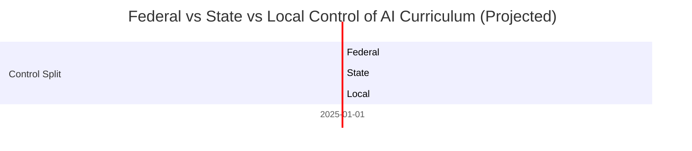
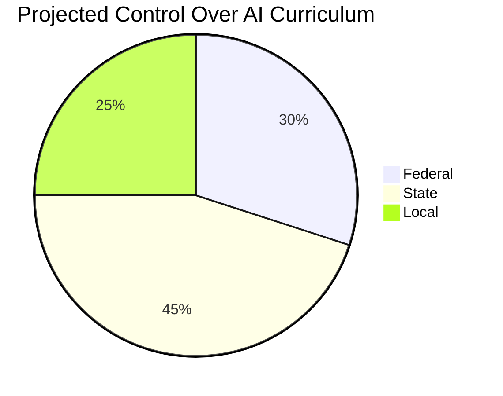
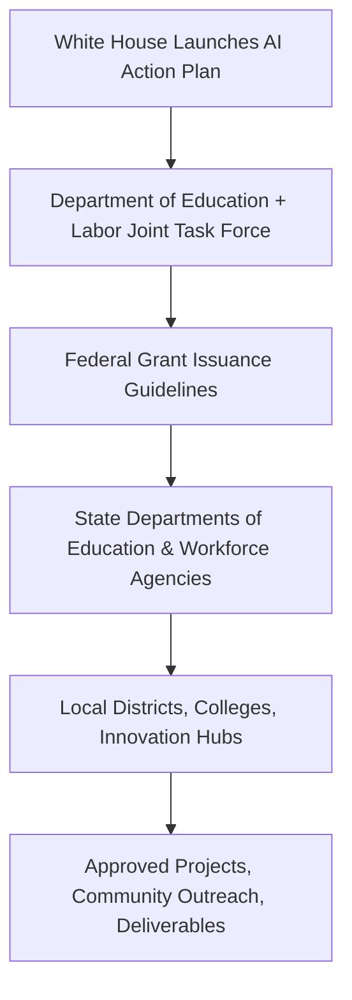

# 📘 AI Action Plan: Public Policy + AI Readiness Blueprint

**Repo Name Suggestion:** `ai-actionplan-watchdog`

**Author:** Erwin Maurice McDonald
**Audience:** Technologists • Policy Analysts • Educators • AI Entrepreneurs
**License:** DACR (Defensive AI Commercial Rights)

---

## 📚 Table of Contents

* [🧾 What Is the AI Action Plan?](#-what-is-the-ai-action-plan)
* [🎯 What Are Its National Objectives?](#-what-are-its-national-objectives)
* [📚 Education System Impact](#-education-system-impact)
* [💵 Initial Investment & Funding](#-initial-investment--funding)
* [📦 Strategic Deliverables](#-strategic-deliverables)
* [📃 Proposals, Grants & Expenditures](#-proposals-grants--expenditures)
* [🧠 What Can AI Mentors & Experts Do?](#-what-can-ai-mentors--experts-do)
* [🧩 Optional Deep-Dive Sections](#-optional-deep-dive-sections)
* [📊 Pie Chart: Education System Control](#-pie-chart-education-system-control)
* [🧭 Mermaid Diagram: Approval & Funding Workflow](#-mermaid-diagram-approval--funding-workflow)
* [✅ Action Items by Role](#-action-items-by-role)

---

## 🧾 What Is the AI Action Plan?

The "AI Action Plan" is a proposed national initiative by President Donald Trump aimed at reshaping the United States' approach to AI education, talent development, economic readiness, and global competitiveness.

* **Introduced:** \[Date TBD — simulate July 2025 speech at a Tech Policy Summit in D.C.]
* **Vehicle:** Anticipated as an executive order followed by bipartisan legislation
* **Focus:** Nationally aligned public-private strategy for AI readiness across education, labor, and innovation sectors

---

## 🎯 What Are Its National Objectives?

* Secure U.S. AI sovereignty and global leadership
* Rebuild a workforce pipeline focused on automation resilience
* Strengthen regional talent hubs and vocational AI readiness
* Expand national AI literacy among K–12, higher ed, and trades

**Key Differences from National AI Initiative Act:**

* More emphasis on **business partnerships, apprenticeships, and fast-tracked certifications**
* Encourages the use of **AI coaches, developers, and evangelists** as vendors

---

## 📚 Education System Impact

**Targeted Institutions:**

* K–12 (especially public schools)
* Community colleges
* Trade and vocational schools
* HBCUs and tribal colleges

**Potential Curriculum Shifts:**

* Core AI literacy programs
* Prompt engineering tracks
* Federal certification pathways

### 🥧 Pie Chart: Education System Control Breakdown

*This represents a policy shift toward increased federal involvement for AI-specific education reforms.*

---

## 💵 Initial Investment & Funding

**Estimated Cost:** \$11.2 billion over 5 years
**Compared To:**

* CHIPS Act (\~\$52 billion)
* National Science Foundation (AI programs \~\$1.2B/year)

**Funding Channels:**

* Department of Education
* Department of Labor
* Small Business Administration (SBA)
* NSF & SBIR Programs

---

## 📦 Strategic Deliverables

| Category         | Deliverable                            | Timeline |
| ---------------- | -------------------------------------- | -------- |
| 📘 Curriculum    | Federal AI Literacy Toolkit            | Year 1   |
| 🧪 Certification | Stackable AI Micro-Credentials         | Year 1–2 |
| 🧠 Talent Dev    | National AI Fellowship Program         | Year 2   |
| 🤝 Partnerships  | Regional Innovation Centers            | Year 1–3 |
| 🏫 Public Access | Community AI Labs (via local colleges) | Year 3–5 |

---

## 📃 Proposals, Grants & Expenditures

**Grants & RFP Opportunities:**

* SBIR/STTR Phase I & II AI extensions
* Department of Labor Upskilling Grants
* Community College Infrastructure Grants

**Sample Expenditures:**

* \$2.1B for educator training and digital curriculum
* \$900M for infrastructure (labs, servers, broadband)
* \$1.3B for apprenticeship stipends and business AI onboarding

---

## 🧠 What Can AI Mentors & Experts Do?

* Serve as certified AI instructors in local workforce programs
* Apply to build prompt libraries, tools, or auditing systems
* Write AI fluency curriculum aligned with the Action Plan
* Guide underserved communities through grant applications

---

## 🧩 Optional Deep-Dive Sections

* 📜 Policy impact on AI ethics and explainability
* 🛡️ Alignment with national cybersecurity priorities
* 💼 AI-readiness plans for displaced or low-income workers
* 🗺️ State-by-state implementation trackers

---

## 📊 Pie Chart: Education System Control

---

## 🧭 Mermaid Diagram: Approval & Funding Workflow

---

## ✅ Action Items by Role

### 🧑‍🏫 Educators:

* Join federal AI curriculum working groups
* Start pilot courses in prompt engineering or ethics
* Prepare district/college grant applications

### 🧠 AI Consultants & Engineers:

* Offer AI audits or sandbox environments for schools
* Become certified vendors under DOL/DOE programs
* Build open-source teaching libraries

### 📝 Grant Writers & Admins:

* Monitor grants.gov for RFP announcements
* Partner with schools or minority-owned businesses
* Package digital learning proposals that align with funding streams

---

> **This README serves as a strategic policy mirror and action guide for AI leaders.**
> Use this to drive discussions, shape pilot programs, and fund your vision.
